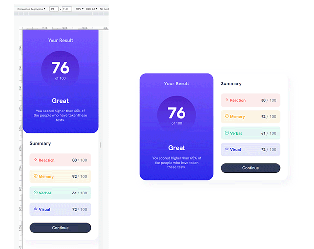

# Frontend Mentor - Results summary component solution

This is a solution to the [Results summary component challenge on Frontend Mentor](https://www.frontendmentor.io/challenges/results-summary-component-CE_K6s0maV). Frontend Mentor challenges help you improve your coding skills by building realistic projects. 

## Table of contents

- [Overview](#overview)
  - [The challenge](#the-challenge)
  - [Screenshot](#screenshot)
  - [Links](#links)
- [My process](#my-process)
  - [Built with](#built-with)
  - [What I learned](#what-i-learned)
  - [Continued development](#continued-development)
  - [Useful resources](#useful-resources)
- [Author](#author)

**Note: Delete this note and update the table of contents based on what sections you keep.**

## Overview

### The challenge

Users should be able to:

- View the optimal layout for the interface depending on their device's screen size
- See hover and focus states for all interactive elements on the page

### Screenshot

### Links

- Solution URL: [Add solution URL here](https://github.com/Shortrope/FEM-results-summary-component)
- Live Site URL: [Add live site URL here](https://your-live-site-url.com)

## My process
I would attempt this challenge and then learn about flexbox, css class naming, media queries or custom properties and then give it another try from scratch...  About 6 redo's on this one.
### Built with
- CSS custom properties
- Flexbox
- media queries
- Kinda BEM and SMACSS

### What I learned
- CSS custom properties
- ideas on class naming conventions and organization
- media queries

### Continued development
- CSS class naming and organization
- Flexbox vs Grid
- Media queries

### Useful resources
- [Keven Powell Youtube channel](https://www.youtube.com/@KevinPowell)
For organizing and naming CSS classes
- [BEM](https://getbem.com/introduction/) 
- [SMACSS](https://smacss.com/)  

## Author

- Website - [Shortrope.com](http://shortrope.com/)
- Frontend Mentor - [@shortrope](https://www.frontendmentor.io/profile/shortrope)

